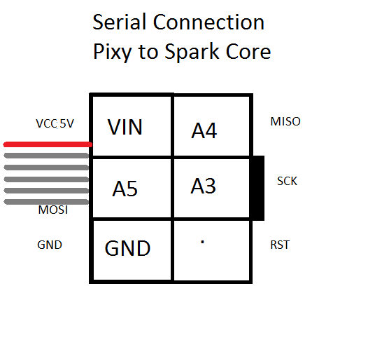
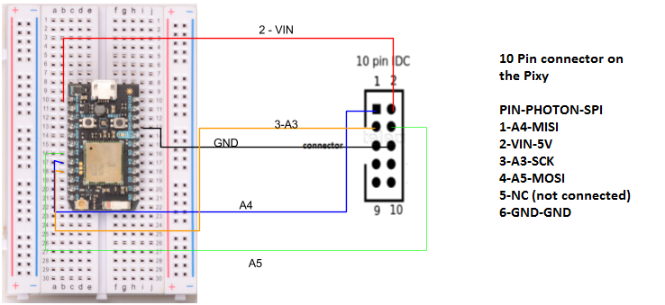
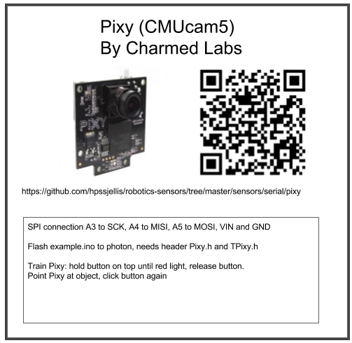

#Connecting a Pixy Camera to a Particle.io Photon

Fairly easy connection with the Pixy cable, uses SPI serial on the Photon connecting PINS A3, A4, A5 See diagram below

If you don't have the special Pixy 10 Pin to 6 Pin cable the connections then become

On the Photon you must load with your example.ino the 2 header files Pixy.h and TPixy.h they do not use .cpp files with them.

Train your pixy on a color. 

Power up

Point pixy at a color object

Hold button on top of Pixy until red color (or other color to train)
On red release button (Pixy now in training mode)

When pixy senses the object color, push button again

Pixy now trained for that color. (Pixy light will match the trained color)

Flash the example.ino to the photon

Watch D7 as the color comes into view. (D7 should flash quicker on one side of it's field of view)

QR code to this site here

Pixy storage label

