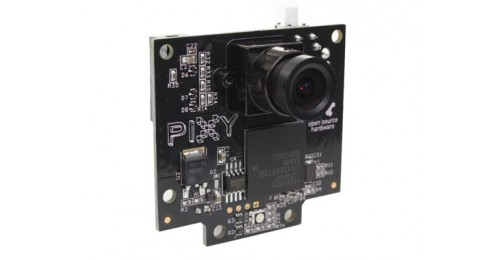
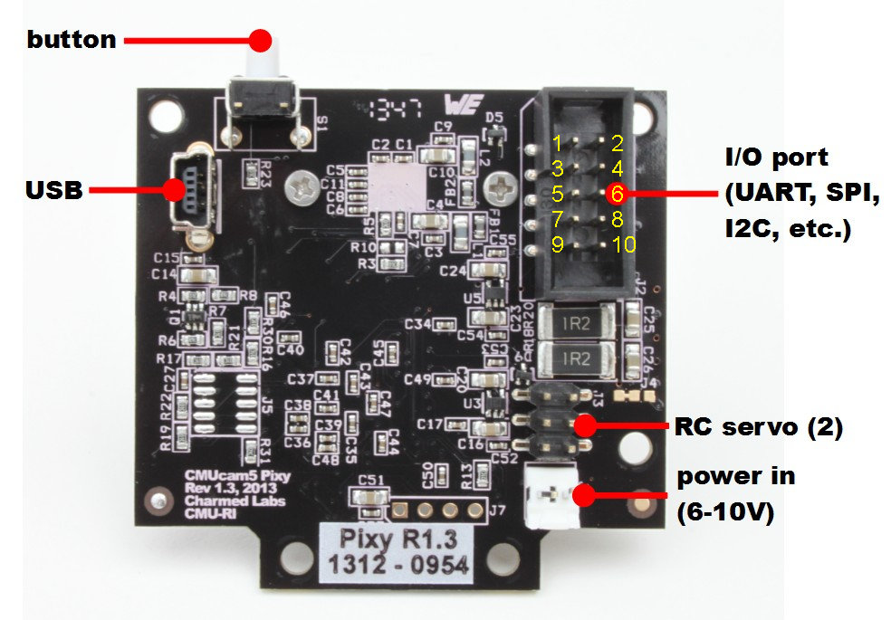

#Connecting a Pixy Camera to a Particle.io Photon

Fairly easy connection with the Pixy cable, uses SPI serial on the Photon connecting PINS A3, A4, A5 See diagram below

If you don't have the special Pixy 10 Pin to 6 Pin cable the connections then become

